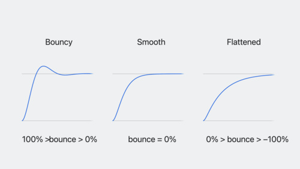
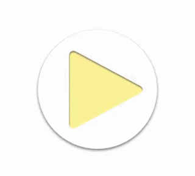
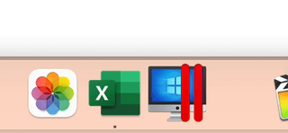
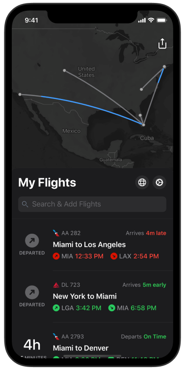
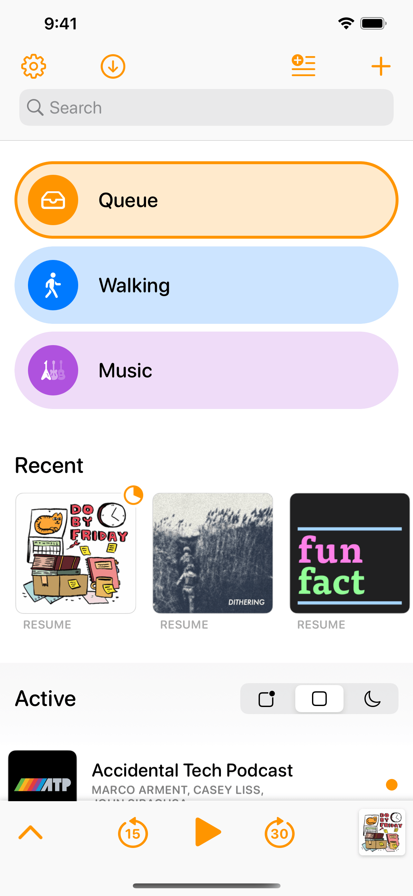
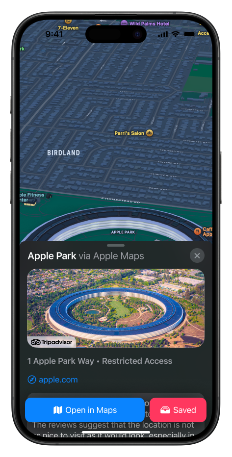

I like Apple's design in their products. It's great, natural, and high-quality. I'm not saying
that other brands like Pixel, Galaxy, and NOTHING have bad design, but I'm just here to talk
about Apple in particular today.

## Spring Animations

One thing many people will notice about Apple's animation is that it's just so smooth and bouncy.
As soon as you swipe-up-to-set-up, you are instantly greeted by your apps elegantly flying in and
bouncing off the "surface" of the home screen, that is, to convince your brain that the screen is 3D.
>  

## Everything Feels Alive

Apple makes apps built with their frameworks (specifically the Cocoa frameworks,) feel alive. When an app on
the Mac needs attention, it jumps at you as if it were to say, "Look at me! Right here!" and on the iPhone,
activities in the Dynamic Island will expand, analogous to someone bursting into your office to tell you
something urgent.
> 

## Apps that Extend Apple Design
I have a little list of apps that do this. They are indie apps, and I personally use them.
One of them is mine :0
>  
> 

And here are some of the blog posts for these apps:
* [The Overcast Redesign: Part One](https://marco.org/2022/03/25/overcast-redesign-2022)
* [Behind the Design: Flighty](https://developer.apple.com/news/?id=970ncww4)

> Cover Image Credit: [Apple Developer](https://developer.apple.com/design)
